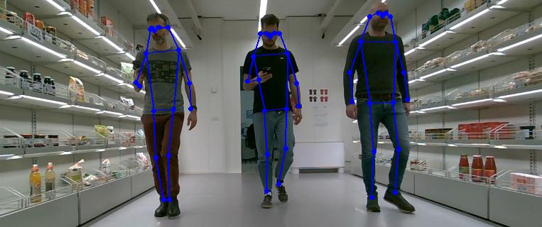
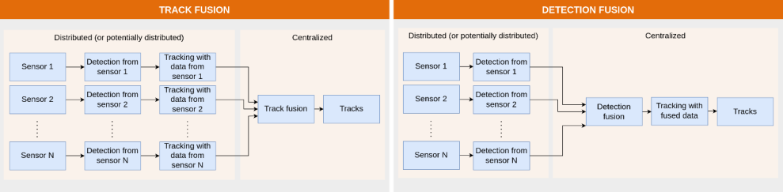

# Introduction

The Rexasi-Tracker is a multi-object and multisensor tracker developed within the EU HORIZON project [REXASI-PRO](https://rexasi-pro.spindoxlabs.com/). It's original purpose is to provide information about people's trajectories to a self-driving wheelchair, so that the wheelchair can reach its destination by calculating socially acceptable paths. Thanks to its modular implementation based on the ROS2 framework, the tracker can be easily adapted to different scenarios. Furthermore, by using the appropriate detectors, it can be used to track objects other than people.

The architecture of the tracker is abstracted into five steps: people detection, people localisation, track generation, track fusion and visualisation.

* **People detection**: the raw data streams from the sensors are processed by algorithms that detect the presence of people in the environment. For example, in the case of an RGBD stream, a people detection algorithm can be used to detect the presence of people by processing the RGB component of the stream. Each sensor is handled by a dedicated ROS2 node, the implementation of which depends on the type of sensor.

* **People localisation**: the purpose of this step is to locate the detections made in the previous step in a common reference system. In the case of the RGBD stream, the depth component of the stream is used to locate the detected people in space with respect to the camera. The extrinsic parameters of the camera are then used for localisation in the common reference system.
* **Track generation**: this step is fed with several streams of people localisations. For each stream, it elaborates the localisations over time and organises them into tracks representing the trajectory followed by the people in the field of view of the sensors. The tracker implements a *track fusion* approach, which means that for each stream of localised detections a different set of tracks (sensor tracks) is processed separately. These tracks are then fused into a unique set of tracks (central tracks). This approach differs from a *detection fusion* approach where the localised detections from the different streams are fused before computing a unique and centralised set of tracks.

* **Track fusion**: this step fuses the different streams of sensor tracks using a nearest neighbour approach and a Kalman filter. This step produces the central tracks, which are those exposed by the people tracker.

This repository provides ROS2 nodes for detecting and locating people using RGBD cameras and laser scanners (2D LIDARs). However, the following pages explain how to implement custom ROS2 nodes to handle different types of sensors. You will also find basic information on how to get started and run the People Tracker.
